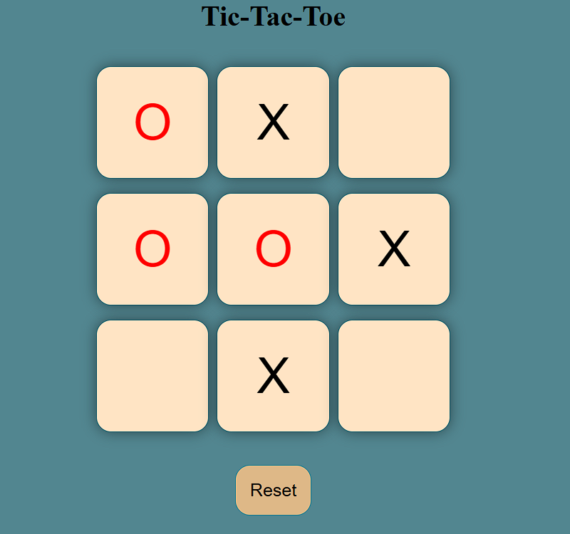

# 🎮 Tic-Tac-Toe Game

A responsive **Tic-Tac-Toe** game built using **HTML**, **CSS**, and **JavaScript**. This project allows two players to play on the same device with features like winner detection, draw detection, reset functionality, and a responsive user interface.

---

## 🚀 Live Demo

👉 **Play the Game:**  
https://rohittopagi.github.io/Tic-Tac-Toe/

---

## 📸 Preview



---

## ✨ Features

- 🎯 Two-player gameplay
- 🏆 Winner detection
- 🤝 Draw detection
- 🔄 Reset Game
- 🆕 New Game
- 🎨 Different colors for **X** and **O**
- ✅ Highlights the winning combination
- 📱 Responsive design using `vmin`
- 🖱️ Hover effects for buttons
- 🚫 Prevents multiple clicks on the same box

---

## 🛠️ Technologies Used

- HTML5
- CSS3
- JavaScript (ES6)
- Git
- GitHub
- GitHub Pages

---

## 📂 Project Structure

```text
📁 Tic-Tac-Toe
│
├── index.html
├── style.css
├── app.js
├── screenshot.png
├── README.md
└── LICENSE
```

---

## ▶️ How to Run Locally

1. Clone the repository:

```bash
git clone https://github.com/rohittopagi/Tic-Tac-Toe.git
```

2. Open the project folder.

3. Open `index.html` in your preferred web browser.

---

## 📖 What I Learned

While building this project, I practiced:

- DOM Manipulation
- Event Listeners
- JavaScript Functions
- Arrays and Loops
- Conditional Statements
- CSS Flexbox
- Responsive Design using `vmin`
- Game Logic Implementation
- Git & GitHub
- GitHub Pages Deployment

---

## 🚀 Future Improvements

- 🤖 Play against Computer (AI)
- 🌙 Dark Mode
- 📊 Scoreboard
- 🔊 Sound Effects
- ✨ Winning Animation
- 🌐 Online Multiplayer
- ⏱️ Move Timer
- 📈 Game Statistics

---

## 👨‍💻 Author

**Rohit Topagi**

GitHub: https://github.com/rohittopagi

---

## ⭐ Support

If you found this project helpful or enjoyed playing the game, consider giving it a ⭐ on GitHub!

Happy Coding! 🚀